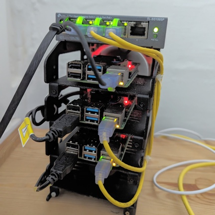

# K3S Playground
A collection of configuration and experiment on a local K3S cluster.

Currently it consists of  3 Raspberry Pi 4 8GB RAM boards running Ubuntu 20.04.5 LTS, connected to a Synology NAS serving as NFS server.

Each PI board uses static IP. /etc/hosts on each board will contain mapping for each node.

| IP address | hostname |
|---|---|
| 192.168.1.201 | pie1 |
| 192.168.1.202 | pie2 |
| 192.168.1.203 | pie3 |

## install K3S on the cluster
[this repo](https://github.com/sloppycoder/k3s-ansible) contains Ansible playbook for installing the K3S on the cluster. 

## Configurations

| folder | content |
|---|---|
| [networking](networking/) | networking setup using kong ingress and servicelb load balancer |
| [storage](storoge/) | storage using [Longhorn](http://longhorn.io) and nfs-subdir-provisioner |
| [datastore](datastore/) | data stores, currently only has Redis |
| [monitoring](monitoring/) | monitorign stack. either [New Relic](https://newrelic.com/) or [Datadog](https://www.datadoghq.com/) |
| [misc](misc/) | utility scripts etc |

