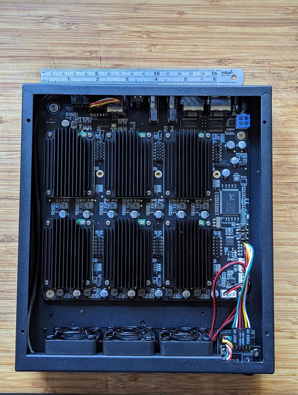

# K3S Playground

A collection of configuration and experiment on a local K3S clusters.

My K3S cluster consists of 6 [Raspberry Pi Compute Module 4](https://www.raspberrypi.com/products/compute-module-4/?variant=raspberry-pi-cm4001000) with 8GB RAM installed on a [Deskpi Super6C board](https://deskpi.com/collections/deskpi-super6c/products/deskpi-super6c-raspberry-pi-cm4-cluster-mini-itx-board-6-rpi-cm4-supported) with [matching case](https://deskpi.com/collections/deskpi-super6c/products/deskpi-itx-case-kit-for-deskpi-super6c-raspberry-pi-cm4-cluster-mini-itx-board). Each board has a NVMe SSD attached.

| IP address | hostname | role |
|---|---|---|
| 192.168.1.204 | pie4 | master for cluster 2, longhorn storage node servicelb node |
| 192.168.1.205 | pie5 | worker node, longhorn storage node |
| 192.168.1.206 | pie6 | worker node, longhorn storage node |
| 192.168.1.207 | pie7 | worker node, longhorn storage node |
| 192.168.1.208 | pie8 | worker node, longhorn storage node |
| 192.168.1.209 | pie9 | worker node, longhorn storage node, servicelb node |

## install K3S on the cluster

[this repo](https://github.com/sloppycoder/k3s-ansible) contains Ansible playbook for installing the K3S on the cluster.

## Configurations

| folder | content |
|---|---|
| [networking](networking/) | networking setup using kong ingress and servicelb load balancer |
| [storage](storage/) | storage using [Longhorn](http://longhorn.io) and nfs-subdir-provisioner |
| [datastore](datastore/) | data stores, currently only has Redis |
| [monitoring](monitoring/) | monitorign stack. either [New Relic](https://newrelic.com/) or [Datadog](https://www.datadoghq.com/) |
| [misc](misc/) | utility scripts etc |
